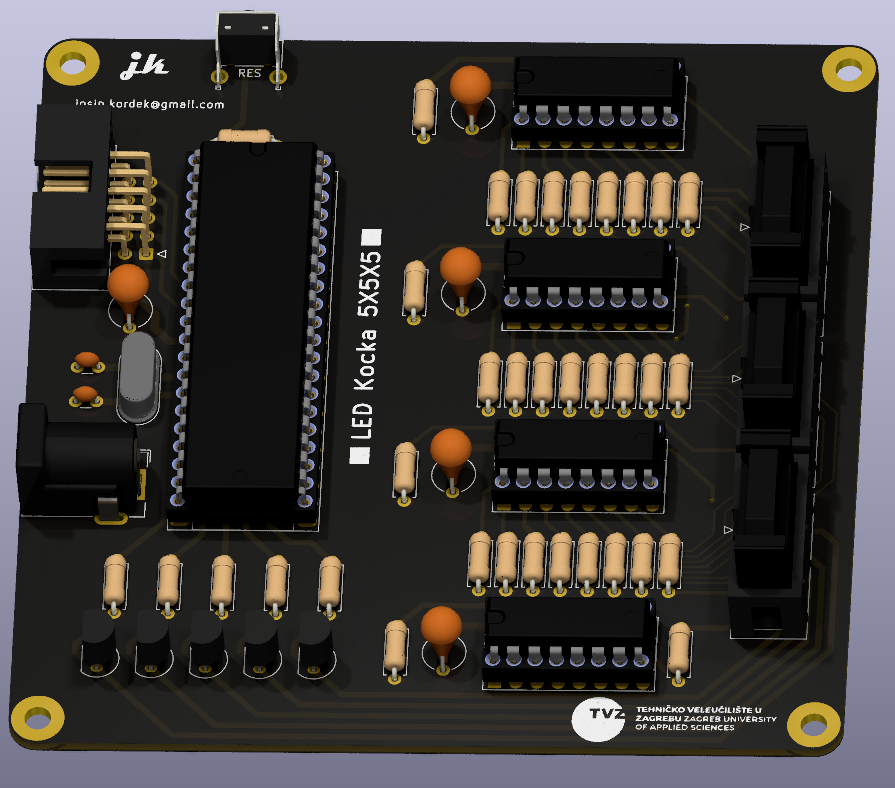
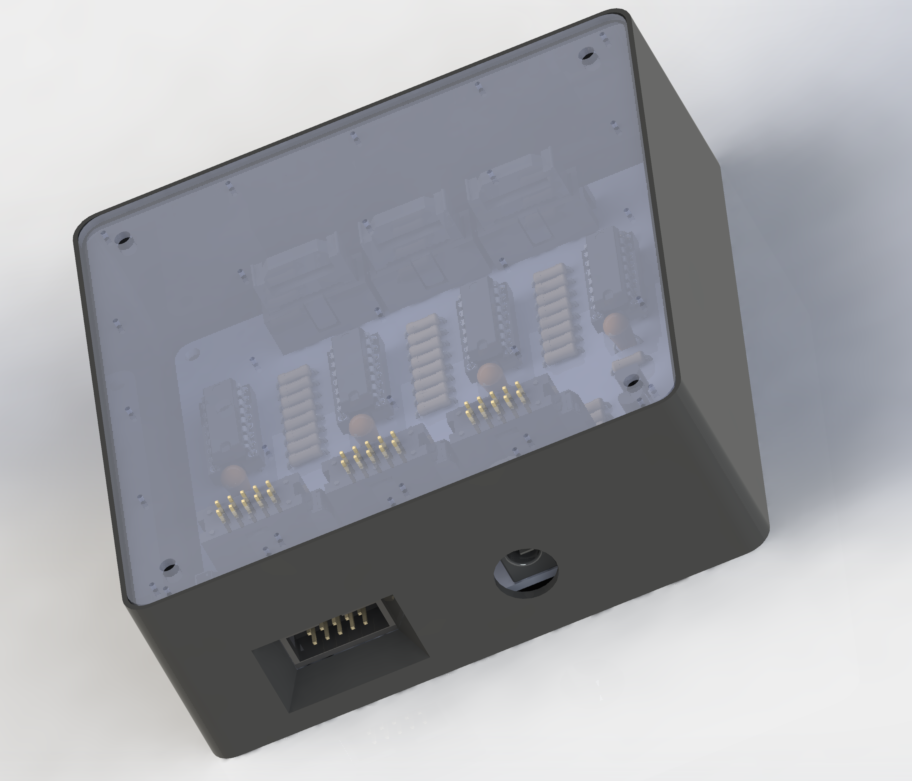

# LedKocka5x5x5
Note: To fix the current KiCad 6.0 issues regarding 3D component models, add the missing KISYS3DMOD to point to the same location as KICAD6_3DMODEL_DIR

Project BOM is not optimal. Due to electronic componente shortages, "on-hand" available components were used.

125 LED cube powered by ATmega16 microcontroller and HC595 shift registers

Video of it in action: https://www.youtube.com/watch?v=YpSFf-s8Nvs

